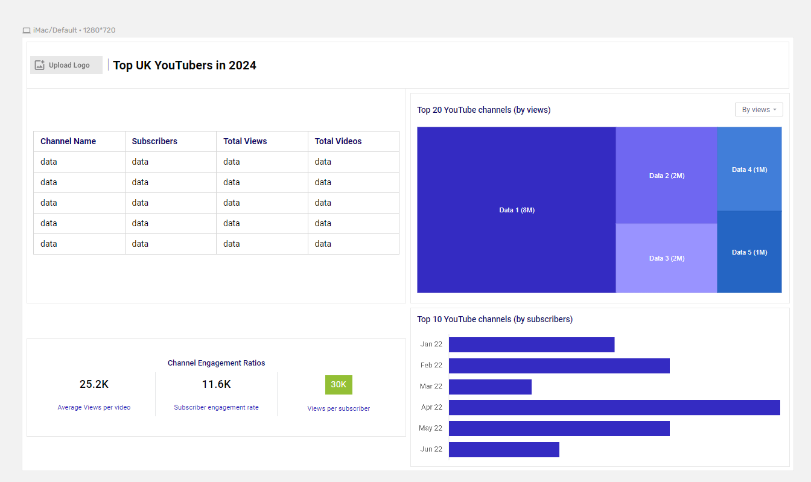

# Top-UK-Youtubers-2024

# 🎯 Objective

The goal is to identify the **top YouTubers in the UK in 2024** to help the Head of Marketing decide which creators to partner with for upcoming marketing campaigns.

---

## ❗ Key Pain Point

The **Head of Marketing** wants clear insights on **who the top YouTubers are in 2024** to determine the best influencers for brand collaborations and advertising campaigns.

---

## 💡 Ideal Solution

Create an **interactive dashboard** that provides detailed insights into the **top UK YouTubers in 2024**, including:


- 📊 **Subscriber count**  
- 👀 **Total views**  
- 🎥 **Total videos**  
- 💬 **Engagement metrics** (likes, comments, etc.)

This dashboard will enable the **marketing team** to make **data-driven decisions** on which YouTubers to collaborate with for maximum campaign impact.


# 🧩 User Story

As the **Head of Marketing**, I want to use a **dashboard** that analyzes **YouTube channel data in the UK**,  
so that I can easily identify the **top-performing channels** based on metrics like **subscriber count** and **average views**.

With this information, I’ll be able to make **informed decisions** about which YouTubers to collaborate with,  
helping to **maximize the effectiveness** of each marketing campaign.

---

## 📊 Data Source

### 🔍 What Data Is Needed?
To achieve the project objective, we need data on the **top UK YouTubers in 2024**, including:

- 🏷️ **Channel names**  
- 👥 **Total subscribers**  
- 👀 **Total views**  
- 🎥 **Total videos uploaded**

---

### 🌐 Where Is the Data Coming From?
The data is sourced from **Kaggle** (Excel extract).  
You can find and download the dataset [here]([#](https://www.kaggle.com/datasets/bhavyadhingra00020/top-100-social-media-influencers-2024-countrywise?resource=download))

# 🚀 Project Stages

1. 🎨 **Design**  
2. 💻 **Development**  
3. 🧪 **Testing**  
4. 📈 **Analysis**

---

## 🧠 Design Stage

### 🧩 Dashboard Components Required

Based on the project requirements, the dashboard should be designed to answer key analytical questions such as:

- 🔝 **Who are the top 10 YouTubers with the most subscribers?**  
- 🎥 **Which 3 channels have uploaded the most videos?**  
- 👀 **Which 3 channels have the most total views?**  
- 📊 **Which 3 channels have the highest average views per video?**  
- ⚖️ **Which 3 channels have the highest views-per-subscriber ratio?**  
- 💬 **Which 3 channels have the highest subscriber engagement rate per video uploaded?**

---

For now, these are the **core questions** our dashboard aims to answer.  
As the **analysis progresses**, additional insights and metrics may be added to enhance the dashboard’s usefulness.

# 📊 Dashboard Mockup

### 🖼️ What Should It Look Like?

The dashboard should display clear, interactive visuals that make it easy to identify top-performing YouTube channels based on key metrics.

### 📈 Recommended Visuals

Some of the data visuals that may be appropriate for answering our analytical questions include:

- 📋 **Table** — for displaying detailed channel information (subscribers, views, videos).  
- 🌳 **Treemap** — to show proportional comparisons, such as total views by channel.  
- 🧮 **Scorecards** — to highlight key summary metrics like total subscribers or average engagement rate.  
- 📊 **Horizontal Bar Chart** — to rank top YouTubers based on subscribers, views, or uploads.  

---

### 🧠 Dashboard Mockup Preview

**Dashboard-Mockup:** 


# 🛠️ Tools & Technologies

| 🧰 **Tool**      | 🎯 **Purpose** |
|------------------|----------------|
| **Excel**        | Exploring and performing initial data analysis then Cleaning, testing, and analyzing the data |
| **Power BI**     | Visualizing data through interactive dashboards |
| **GitHub**       | Hosting project documentation and version control |
| **Mokkup AI**    | Designing the wireframe/mockup of the dashboard |


# ⚙️ Pseudocode

### 🧭 General Approach

The following outlines the step-by-step process for creating this solution from start to finish:

1. 📥 **Get the data**  
2. 📊 **Explore the data in Excel**  
3. 🧹 **Clean the data** using Excel  
4. 🧪 **Test the data** in Excel to ensure accuracy  
5. 📈 **Visualize the data** in Power BI  
6. 🔍 **Generate insights** and key findings based on visual analysis  
7. 📝 **Write documentation and commentary** explaining the process and results  
8. 🌐 **Publish the final output** (data and report) on GitHub Pages  

---

# 🔍 Data Exploration Notes

### 🧾 Overview

This stage involves scanning the dataset for **errors, inconsistencies, missing values, or unusual characters** that could affect analysis.

### 🧠 Initial Observations

- There are **at least 4 relevant columns** containing all the necessary data for this a


# 🧹 Data Cleaning

### 🎯 Objective

The goal of this stage is to **refine the dataset** so it’s well-structured, consistent, and ready for accurate analysis.

---

## ✅ Expected Clean Data Format

The cleaned dataset should meet the following **criteria and constraints**:

- Only **relevant columns** are retained.  
- All **data types** are appropriate for their contents.  
- No column should contain **null or missing values**, ensuring completeness and reliability.

---

### 📏 Cleaned Dataset Constraints

| 🧩 **Property**       | 📋 **Description** |
|------------------------|--------------------|
| **Number of Rows**     | 100 |
| **Number of Columns**  | 4 |

---

## 🧠 Data Cleaning Steps

To prepare the dataset for analysis, the following steps will be performed:

1. 🗑️ **Remove unnecessary columns** — keep only the required fields for analysis.  
2. 🔡 **Extract YouTube channel names** from the first column using text parsing or formula logic.  
3. 🏷️ **Rename columns** for clarity and consistency across the dataset.  

---

After these steps, the dataset will be **structured, clean, and ready** for visualization in Power BI.

# 📊 Visualization

### 🧾 Results

#### 💻 Dashboard Overview

Below is the Power BI dashboard created for this project:

---

### 🖼️ Dashboard Preview

**GIF of Power BI Dashboard:**  


---

### 📈 Description

This dashboard showcases the **Top UK YouTubers in 2024**, highlighting key metrics such as:

- 👥 **Subscribers**
- 👀 **Total Views**
- 🎥 **Number of Videos**
- 💬 **Engagement Metrics**

It provides a **clear visual summary** of YouTube performance, helping the marketing team identify the most influential creators to collaborate with.

# 🧮 DAX Measures

Below are the key DAX measures created for this project to calculate and visualize insights in **Power BI**.

---

## 1. 📊 Total Subscribers (M)

```DAX
Total Subscribers (M) = 
VAR million = 1000000
VAR sumOfSubscribers = SUM(view_uk_youtubers_2024[total_subscribers])
VAR totalSubscribers = DIVIDE(sumOfSubscribers, million)
RETURN totalSubscribers


Total Views (B) = 
VAR billion = 1000000000
VAR sumOfTotalViews = SUM(view_uk_youtubers_2024[total_views])
VAR totalViews = ROUND(sumOfTotalViews / billion, 2)
RETURN totalViews

Total Videos = 
VAR totalVideos = SUM(view_uk_youtubers_2024[total_videos])
RETURN totalVideos

Average Views per Video (M) = 
VAR sumOfTotalViews = SUM(view_uk_youtubers_2024[total_views])
VAR sumOfTotalVideos = SUM(view_uk_youtubers_2024[total_videos])
VAR avgViewsPerVideo = DIVIDE(sumOfTotalViews, sumOfTotalVideos, BLANK())
VAR finalAvgViewsPerVideo = DIVIDE(avgViewsPerVideo, 1000000, BLANK())
RETURN finalAvgViewsPerVideo

Subscriber Engagement Rate = 
VAR sumOfTotalSubscribers = SUM(view_uk_youtubers_2024[total_subscribers])
VAR sumOfTotalVideos = SUM(view_uk_youtubers_2024[total_videos])
VAR subscriberEngRate = DIVIDE(sumOfTotalSubscribers, sumOfTotalVideos, BLANK())
RETURN subscriberEngRate

Views Per Subscriber = 
VAR sumOfTotalViews = SUM(view_uk_youtubers_2024[total_views])
VAR sumOfTotalSubscribers = SUM(view_uk_youtubers_2024[total_subscribers])
VAR viewsPerSubscriber = DIVIDE(sumOfTotalViews, sumOfTotalSubscribers, BLANK())
RETURN viewsPerSubscriber


# 🔍 Analysis

## 📈 Findings

### 🧠 Objective
This analysis focuses on answering key questions to help the **Head of Marketing** identify the most valuable YouTubers in the UK for 2024 marketing campaigns.

---

### ❓ Key Questions

1. Who are the top 10 YouTubers with the most subscribers?  
2. Which 3 channels have uploaded the most videos?  
3. Which 3 channels have the most total views?  
4. Which 3 channels have the highest average views per video?  
5. Which 3 channels have the highest views per subscriber ratio?  
6. Which 3 channels have the highest subscriber engagement rate per video uploaded?

---

## 🏆 1. Top 10 YouTubers by Subscribers

| Rank | Channel Name        | Subscribers (M) |
|------|---------------------|-----------------|
| 1    | NoCopyrightSounds   | 33.60           |
| 2    | DanTDM              | 28.60           |
| 3    | Dan Rhodes          | 26.50           |
| 4    | Miss Katy           | 24.50           |
| 5    | Mister Max          | 24.40           |
| 6    | KSI                 | 24.10           |
| 7    | Jelly               | 23.50           |
| 8    | Dua Lipa            | 23.30           |
| 9    | Sidemen             | 21.00           |
| 10   | Ali-A               | 18.90           |

---

## 🎥 2. Channels with the Most Videos Uploaded

| Rank | Channel Name     | Videos Uploaded |
|------|------------------|-----------------|
| 1    | GRM Daily        | 14,696          |
| 2    | Manchester City  | 8,248           |
| 3    | Yogscast         | 6,435           |

---

## 👀 3. Channels with the Most Total Views

| Rank | Channel Name | Total Views (B) |
|------|---------------|----------------|
| 1    | DanTDM        | 19.78           |
| 2    | Dan Rhodes     | 18.56           |
| 3    | Mister Max     | 15.97           |

---

## 📊 4. Channels with the Highest Average Views per Video

| Channel Name | Avg. Views per Video (M) |
|---------------|--------------------------|
| Mark Ronson   | 32.27                    |
| Jessie J      | 5.97                     |
| Dua Lipa      | 5.76                     |

---

## 🔁 5. Channels with the Highest Views per Subscriber Ratio

| Rank | Channel Name       | Views per Subscriber |
|------|--------------------|----------------------|
| 1    | GRM Daily          | 1,185.79             |
| 2    | Nickelodeon        | 1,061.04             |
| 3    | Disney Junior UK   | 1,031.97             |

---

## 💬 6. Channels with the Highest Subscriber Engagement Rate per Video

| Rank | Channel Name | Subscriber Engagement Rate |
|------|---------------|-----------------------------|
| 1    | Mark Ronson   | 343,000                     |
| 2    | Jessie J      | 110,416.67                  |
| 3    | Dua Lipa      | 104,954.95                  |

---

## 📝 Notes

For this analysis, the focus was on metrics that **directly impact marketing ROI**, such as:

- 📈 **Subscriber count**
- 👀 **Total views**
- 🎥 **Videos uploaded**

These insights provide a **data-driven foundation** for selecting YouTubers that can offer the **best audience reach and engagement** for marketing campaigns.

# ✅ Validation

## 🎯 Objective
To validate our analysis, we estimate potential **marketing ROI** for collaborations with the top YouTubers based on their average views and engagement metrics.

---

## 1. 📊 YouTubers with the Most Subscribers

### 💡 Campaign Idea: Product Placement

---

### 🧮 a. NoCopyrightSounds

| Metric | Calculation | Result |
|--------|--------------|--------|
| **Average Views per Video** | — | 6.92M |
| **Product Cost** | — | $5 |
| **Conversion Rate** | — | 2% |
| **Potential Units Sold** | 6.92M × 2% | **138,400 units** |
| **Potential Revenue** | 138,400 × $5 | **$692,000** |
| **Campaign Cost** | — | $50,000 |
| **Net Profit** | $692,000 − $50,000 | **$642,000** |

---

### 🧮 b. DanTDM

| Metric | Calculation | Result |
|--------|--------------|--------|
| **Average Views per Video** | — | 5.34M |
| **Product Cost** | — | $5 |
| **Conversion Rate** | — | 2% |
| **Potential Units Sold** | 5.34M × 2% | **106,800 units** |
| **Potential Revenue** | 106,800 × $5 | **$534,000** |
| **Campaign Cost** | — | $50,000 |
| **Net Profit** | $534,000 − $50,000 | **$484,000** |

---

### 🧮 c. Dan Rhodes

| Metric | Calculation | Result |
|--------|--------------|--------|
| **Average Views per Video** | — | 11.15M |
| **Product Cost** | — | $5 |
| **Conversion Rate** | — | 2% |
| **Potential Units Sold** | 11.15M × 2% | **223,000 units** |
| **Potential Revenue** | 223,000 × $5 | **$1,115,000** |
| **Campaign Cost** | — | $50,000 |
| **Net Profit** | $1,115,000 − $50,000 | **$1,065,000** |

---

### 🏆 Best Option from this Category: **Dan Rhodes**

With the highest **average views per video (11.15M)** and an estimated **net profit of $1.065M per campaign**, **Dan Rhodes** represents the **best ROI opportunity** for marketing collaborations.

# ✅ Validation (Part 2)

## 🎥 2. YouTubers with the Most Videos Uploaded

### 💡 Campaign Idea: Sponsored Video Series

---

### 🧮 a. GRM Daily

| Metric | Calculation | Result |
|--------|--------------|--------|
| **Average Views per Video** | — | 510,000 |
| **Product Cost** | — | $5 |
| **Conversion Rate** | — | 2% |
| **Potential Units Sold** | 510,000 × 2% | **10,200 units** |
| **Potential Revenue** | 10,200 × $5 | **$51,000** |
| **Campaign Cost** | 11 videos × $5,000 | **$55,000** |
| **Net Profit** | $51,000 − $55,000 | **–$4,000 (loss)** |

---

### 🧮 b. Manchester City

| Metric | Calculation | Result |
|--------|--------------|--------|
| **Average Views per Video** | — | 240,000 |
| **Product Cost** | — | $5 |
| **Conversion Rate** | — | 2% |
| **Potential Units Sold** | 240,000 × 2% | **4,800 units** |
| **Potential Revenue** | 4,800 × $5 | **$24,000** |
| **Campaign Cost** | 11 videos × $5,000 | **$55,000** |
| **Net Profit** | $24,000 − $55,000 | **–$31,000 (loss)** |

---

### 🧮 c. Yogscast

| Metric | Calculation | Result |
|--------|--------------|--------|
| **Average Views per Video** | — | 710,000 |
| **Product Cost** | — | $5 |
| **Conversion Rate** | — | 2% |
| **Potential Units Sold** | 710,000 × 2% | **14,200 units** |
| **Potential Revenue** | 14,200 × $5 | **$71,000** |
| **Campaign Cost** | 11 videos × $5,000 | **$55,000** |
| **Net Profit** | $71,000 − $55,000 | **$16,000 (profit)** |

---

### 🏆 Best Option from this Category: **Yogscast**

Among the channels with the most uploads, **Yogscast** provides the **best ROI** opportunity — delivering an estimated **$16,000 profit** from a sponsored video series, while others in this category show potential losses.

# ✅ Validation (Part 3)

## 🎥 3. YouTubers with the Most Views

### 💡 Campaign Idea: Influencer Marketing

---

### 🧮 a. DanTDM

| Metric | Calculation | Result |
|--------|--------------|--------|
| **Average Views per Video** | — | 5.34 million |
| **Product Cost** | — | $5 |
| **Conversion Rate** | — | 2% |
| **Potential Units Sold** | 5.34M × 2% | **106,800 units** |
| **Potential Revenue** | 106,800 × $5 | **$534,000** |
| **Campaign Cost** | 3-month contract | **$130,000** |
| **Net Profit** | $534,000 − $130,000 | **$404,000** |

---

### 🧮 b. Dan Rhodes

| Metric | Calculation | Result |
|--------|--------------|--------|
| **Average Views per Video** | — | 11.15 million |
| **Product Cost** | — | $5 |
| **Conversion Rate** | — | 2% |
| **Potential Units Sold** | 11.15M × 2% | **223,000 units** |
| **Potential Revenue** | 223,000 × $5 | **$1,115,000** |
| **Campaign Cost** | 3-month contract | **$130,000** |
| **Net Profit** | $1,115,000 − $130,000 | **$985,000** |

---

### 🧮 c. Mister Max

| Metric | Calculation | Result |
|--------|--------------|--------|
| **Average Views per Video** | — | 14.06 million |
| **Product Cost** | — | $5 |
| **Conversion Rate** | — | 2% |
| **Potential Units Sold** | 14.06M × 2% | **281,200 units** |
| **Potential Revenue** | 281,200 × $5 | **$1,406,000** |
| **Campaign Cost** | 3-month contract | **$130,000** |
| **Net Profit** | $1,406,000 − $130,000 | **$1,276,000** |

---

### 🏆 Best Option from this Category: **Mister Max**

Among YouTubers with the highest total views, **Mister Max** offers the **highest potential ROI** — generating an estimated **$1.28 million profit** under the proposed influencer marketing campaign.  
This makes **Mister Max** the strongest candidate for a long-term collaboration.

# 📊 Discovery

## 🔍 What Did We Learn?

We discovered that:

- **NoCopyrightSounds**, **Dan Rhodes**, and **DanTDM** have the **most subscribers** in the UK.  
- **GRM Daily**, **Man City**, and **Yogscast** have the **most videos uploaded**.  
- **DanTDM**, **Dan Rhodes**, and **Mister Max** have the **most views**.  
- **Entertainment and music channels** dominate engagement — they post more consistently and generate broader reach.

---

# 🎯 Recommendations

## 💡 Insights-Based Suggestions

- **Dan Rhodes** is the **best YouTube partner** for maximizing **visibility**, given his high subscriber count and engagement.  
- While **GRM Daily**, **Man City**, and **Yogscast** post frequently, their **ROI potential is lower** based on the budget constraints.  
- **Mister Max** is ideal for **maximum reach**, while **DanTDM** and **Dan Rhodes** are stronger **long-term collaborators** due to audience size and engagement consistency.  
- **Top 3 Channels to Collaborate With:**
  1. NoCopyrightSounds  
  2. DanTDM  
  3. Dan Rhodes  

These consistently attract the **most engagement** across the UK YouTube space.

---

# 💰 Potential ROI

## 📈 Expected Returns

| Channel | Campaign Type | Estimated Net Profit |
|----------|----------------|----------------------|
| **Dan Rhodes** | Collaboration deal | **$1,065,000 per video** |
| **Mister Max** | Influencer marketing | **$1,276,000** |
| **DanTDM** | Product placement | **$484,000 per video** |
| **DanTDM** | Influencer marketing | **$404,000** |
| **NoCopyrightSounds** | Sponsored video | **$642,000 per video** |

---

# 🚀 Action Plan

## 🧭 Recommended Course of Action

Based on the analysis, the **best long-term partnership** for promoting the client’s products is with **Dan Rhodes**.

We’ll collaborate with the client to set expectations, define KPIs, and track milestones. Once we achieve the target metrics, we’ll consider expanding to **DanTDM**, **Mister Max**, and **NoCopyrightSounds** for extended reach.

---

## 🛠️ Implementation Steps

1. **Reach out** to the teams managing each target channel — starting with **Dan Rhodes**.  
2. **Negotiate contracts** aligned with the budget and marketing goals.  
3. **Launch campaigns** and monitor engagement and conversion metrics.  
4. **Evaluate performance**, gather insights, and **optimize future collaborations** based on audience feedback and ROI outcomes.
